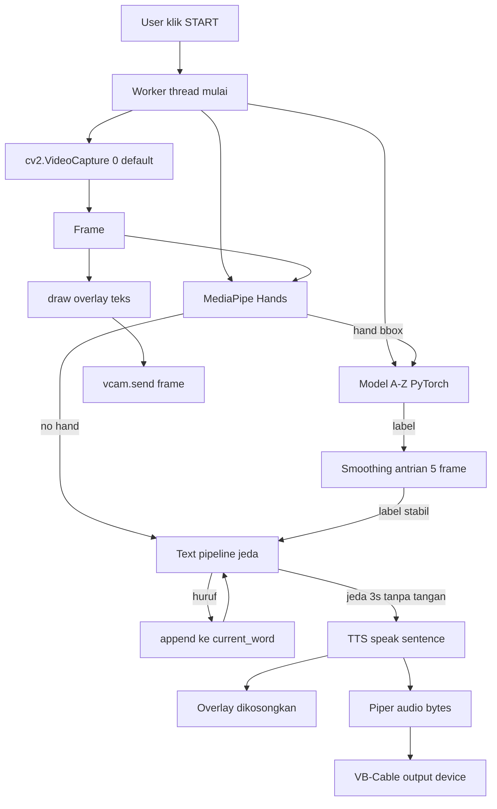
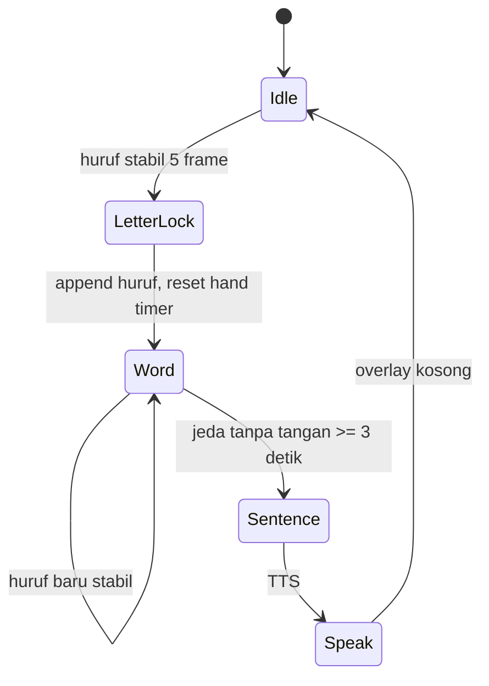

# TECH_SPEC — IsyaratKu Cam

## 1. Arsitektur

Satu proses, **satu thread kerja** untuk kamera+AI (di luar main thread GUI).
Tanpa asyncio, database, plugin, config UI, atau logging framework. State
pipeline ditukar dengan antrean thread-safe (`queue.Queue`) berkapasitas kecil.

```
┌─────────────────────────── Main Thread ───────────────────────────┐
│  PySide6 + PySide6-Fluent-Widgets                                 │
│    StartStopButton  StatusIndicator  FontSlider                   │
│    • Start → start WorkerThread, status=Berjalan                  │
│    • Stop  → set run flag False, join thread, status=Berhenti    │
│    • Slider → font_size (di-update ke worker tiap frame)         │
└───────────────────────────────┬──────────────────────────────────┘
                                │ control flags + Queue(hasil status)
┌───────────────────────────────▼── Worker Thread ──────────────────┐
│  1. cap = cv2.VideoCapture(0)           # kamera default          │
│  2. hands = mp.solutions.hands.Hands                           │
│  3. model = load('models/bisindo_alphabet/')   # PyTorch          │
│  4. while running:                                                │
│        frame → flip → mediapipe hands                             │
│        crop bbox tangan (padding) → resize → torch → kelas        │
│        ── pipeline teks ── (lihat §4)                              │
│        draw overlay → vcam.send(frame) → vcam.sleep_until_next_frame│
└───────────────────────────────┬──────────────────────────────────┘
                                ▼
        pyvirtualcam (Unity Capture, Windows)
                                ▼
                       OBS / Zoom / Meet

Samping (non-blocking): text → Piper TTS (ONNX) → byte audio → VB-Cable
```

### Mermaid — alur kontrol & data



### Mermaid — pipeline teks (state sederhana)



## 2. Struktur Folder

```
isyaratku_cam/
├── docs/                 # PRD.md TECH_SPEC.md BUILD_ORDER.md
├── AGENTS.md
├── requirements.txt
├── main.py               # entrypoint: GUI + start/stop
├── worker.py             # thread kamera+AI+overlay+vcam
├── recognizer.py         # load model + prediksi + smoothing
├── text_pipeline.py      # huruf -> kata -> kalimat + timer
├── tts.py                # Piper ONNX + output VB-Cable
├── virtual_cam.py        # wrapper pyvirtualcam + teks overlay
├── recorder_cli.py       # OPSIONAL: rekam dataset sendiri (di luar MVP)
├── scripts/
│   ├── download_models.sh    # unduh bobot Piper + model A-Z
│   └── check_env.py          # cek python deps & device virtual
└── models/               # .pt / .onnx + labels.json (tidak di-commit)
```

## 3. Tanggung Jawab Modul

| Modul | Tanggung jawab | Tidak boleh |
|---|---|---|
| `main.py` | GUI, status, start/stop, pasang worker | logika AI |
| `worker.py` | loop frame, deteksi tangan, panggil recognizer & text_pipeline, kirim overlay ke vcam | punya rule bisnis teks |
| `recognizer.py` | load model PyTorch, `predict(frame) -> label` | akses cv2/UI |
| `text_pipeline.py` | state huruf/kata/kalimat + timer jeda | operasi frame |
| `tts.py` | muat voice Piper, `speak(text)`, cari device VB-Cable by name | gate status UI |
| `virtual_cam.py` | `draw_text(frame, txt, font_size)`, send ke `pyvirtualcam` | klasifikasi |
| `recorder_cli.py` | CLI rekam citra tangan per kelas | dipakai GUI |

Max ~600 baris kode inti; kandidat rujukan sebelum menulis kode baru:
`Syizuril/bisindo-sign-language` (HF), `Louisljz/bisindo-sign-lang-recog`
(HF Space), `AceKinnn/WL-BISINDO` (Kaggle baseline), `rhasspy/piper-voices`.

## 4. Pipeline Pengenalan + Smoothing + Huruf→Kata→Kalimat

1. Frame → MediaPipe Hands. Jika tidak ada tangan → `hand_absent` + timer jalan.
2. Ada tangan → crop bbox (padding 20px) → resize 224×224 → model A-Z → label.
3. **Smoothing**: deque berisi 5 prediksi terakhir. Label dianggap stabil
   jika ≥ 4 dari 5 identik. Mencegah jitter sajian demo.
4. **Huruf→kata**: saat label stabil dan berbeda dari label terakhir yang
   diterima → append ke `current_word`, reset `hand_absent_timer`.
5. **Kalimat otomatis**: tangan **hilang** ≥ 3 detik → `speak(current_word)`
   via Piper, lalu buffer dibersihkan dan overlay bersih (FR-07/AC-03).
   Menahan satu isyarat tetap di frame **tidak** boleh mengucapkan kata yang
   belum selesai. Tangan hilang juga mereset `prev_letter` + smoothing, supaya
   huruf pertama kata berikutnya tidak tertahan.
6. Overlay digambar sebagai **subtitle film**: teks putih dengan outline hitam
   tebal, terpusat horizontal, baseline 8% di atas bawah frame. Tanpa band
   gelap (sesuai referensi `contoh penempatan subtitle.png`).

Pseudo:

```
stable = deque(maxlen=5)
on label:
    stable.append(label)
    if len(stable) < 5 or stable.count(label) < 4: return
    if label == last_letter: return          # satu ketukan = satu huruf
    last_letter = label
    word += label
    hand_absent_since = None                  # tangan ada: belum flush

tick():  # tiap frame
    if no_hand:
        last_letter = None; stable.clear()   # huruf pertama kata berikutnya bebas
        if hand_absent_since is None: hand_absent_since = now
    if word and hand_absent_since and now - hand_absent_since >= 3.0:
        tts.speak(word); word = ""; hand_absent_since = None
```

## 5. Integrasi Kamera Virtual + Audio Virtual + Piper

**Kamera virtual.** Output utama = **OBS Virtual Camera** (dipakai Zoom/Meet),
diikuti Unity Capture bila OBS tidak jalan (`BACKEND_ORDER = ("obs",
"unitycapture")`). Uji video lewat self-view Zoom/Meet, bukan OBS.

```python
import pyvirtualcam
with pyvirtualcam.Camera(width=1280, height=720, fps=30) as cam:
    cam.send(frame)  # BGR, ukuran sama
```

**TTS Piper.** Voice `id-ID-news_tts-medium` (ONNX ±63 MB) dari
`rhasspy/piper-voices`; path diambil dari `voices.json`
(`.../id/id_ID/news_tts/medium/...`). Tidak di-bundle — diunduh saat setup via
`scripts/download_models.sh`. Wajib `espeak-ng` terpasang (voice `id_ID` pakai
fonemisasi espeak). Lisensi MODEL_CARD **belum diverifikasi** → catat di README
sebelum distribusi.
Audio disintesis lalu diputar ke perangkat output VB-Cable yang dicari
berdasarkan nama perangkat (mis. contains `CABLE`).

```python
# tts.py (ringkas)
import sounddevice as sd
CABLE_HINT = "CABLE"
device = next(i for i,d in sd.query_devices().items()
              if d["max_output_channels"] > 0 and CABLE_HINT in d["name"])
sd.play(audio_int16, samplerate=22050, device=device)
```

**Tidak ada dropdown** kamera/audio di GUI. Device salah/absen → status Error.

## 6. Kandidat Model & Cara Tes

| Kandidat | Jenis | Status | Tes |
|---|---|---|---|
| `Syizuril/bisindo-sign-language` (EfficientNet-B3, gambar, torch) | Alfabet A–Z | **Prioritas 1**, wajib lolos webcam nyata | `python scripts/test_webcam.py`: live webcam, per 10 frame cetak label + top-3 confidence; isyaratkan A–Z, catat benar/salah + kondisi cahaya |
| `Louisljz/bisindo-sign-lang-recog` (`sign_transformer.keras` + `labels.json`) | Kata | Opsional, periksa isi `labels.json` dulu (jumlah & nama kelas) | Load keras, uji gambar contoh + 1 demo webcam; catat akurasi |
| WL-BISINDO (Kaggle, 32 kata) + `AceKinnn/WL-BISINDO` | Kata | Fallback jika bobot terlatih tak tersedia: latih **sekali** secara offline | Jalankan baseline repo; catat akurasi validasi; konversi bila perlu |
| Kaggle "Indonesian Sign Language - BISINDO" (`agungmrf`) | Alfabet | Cadangan bila kandidat 1 gagal | Sama seperti kandidat 1 |

**[ASUMSI model A-Z utama]** `Syizuril/bisindo-sign-language` repo publik tanpa
token, tapi lisensi tidak tertulis dan urutan label (A-Z), ukuran input, serta
normalisasi tidak terdokumentasi. Harus divalidasi di M2 dengan `scripts/test_webcam.py`
sebelum dipakai. Bobot tidak di-commit; unduh via `scripts/download_models.sh`.

**Catatan jujur (wajib masuk laporan):** variasi regional isyarat,
pencahayaan, jarak tangan dari kamera, dan latar belakang memengaruhi akurasi.
Semua hasil tes dicatat di `docs/MODEL_SELECTION.md` (milestone M2).

## 7. Error Handling

| Kondisi | Perilaku |
|---|---|
| Driver kamera virtual tidak terpasang | Status `Error: kamera virtual tidak ditemukan (pasang Unity Capture)`, worker berhenti rapi |
| VB-Cable tidak terpasang | Status `Error: VB-Cable tidak ditemukan`, pipeline tetap jalan, hanya TTS yang mati |
| File model / voice hilang | Status `Error: model tidak ditemukan`, stop otomatis |
| Webcam tidak terbaca | Status `Error: webcam tidak ditemukan` |
| Frame rusak | Lewati frame, jangan crash thread |

Semua pesan singkat, satu baris, hanya teks (tanpa dialog modal).

## 8. Instalasi

```bash
# 1. Python deps
python -m venv .venv && .venv\Scripts\activate
pip install -r requirements.txt     # opencv-python mediapipe torch pyvirtualcam sounddevice piper-tts PySide6 PySide6-Fluent-Widgets

# 2. Kamera virtual
#    Unity Capture: https://github.com/schellingb/UnityCapture
#    Install.bat SEKALI sebagai Administrator. DirectShow filter —
#    tidak perlu test mode / driver unsigned.

# 3. Audio virtual
#    VB-Cable: https://vb-audio.com/Cable/

# 4. espeak-ng (WAJIB — voice id_ID pakai fonemisasi espeak)
#    https://github.com/espeak-ng/espeak-ng/releases (installer .exe)

# 5. Model + voice (jangan commit bobot; unduh saat setup)
bash scripts/download_models.sh
python scripts/check_env.py
```

Driver Windows dipasang manual oleh pengguna (README menyertakan instruksi).
Di Zoom/Meet: kamera = "Unity Capture Camera", mikrofon = "CABLE Output" (VB-Cable).
Kalau Unity Capture tidak muncul setelah `Install.bat` (Admin), fallback ke
OBS Virtual Camera.

**Lisensi:** repo model `Syizuril/bisindo-sign-language` publik, tanpa token,
tapi lisensi tidak tertulis — bobot hanya diunduh, tidak didistribusikan ulang.
Voice Piper `id-ID-news_tts-medium` lisensi MODEL_CARD **belum diverifikasi** —
catat di README sebelum distribusi ke pihak lain.

## 9. Verifikasi

```bash
python scripts/check_env.py            # device virtual + file model ada
python main.py                          # klik Start → status Berjalan
# Bukti end-to-end: OBS tampilkan stream dengan overlay; Zoom/Meet dengar TTS
```
